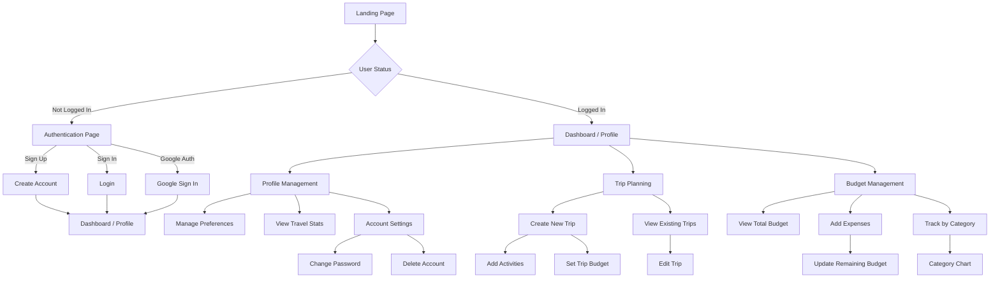

# TravelGenie - User Flow Diagram

## Detailed User Flows

### 1. Authentication Flow
1. User arrives at landing page
2. Options to:
   - Sign up with email/password
   - Login with existing account
   - Sign in with Google
3. After successful authentication, redirected to profile

### 2. Profile Management Flow
1. View/Edit personal information:
   - Full name
   - Phone number
   - Location
2. Upload/Change profile picture
3. Manage preferences:
   - Email notifications
   - Profile visibility
   - Currency preference
4. View travel statistics:
   - Trips planned
   - Countries visited
   - Activities completed
   - Travel buddies
5. Account settings:
   - Change password (via email)
   - Delete account (requires confirmation)

### 3. Trip Planning Flow
1. Create new trip:
   - Set trip dates
   - Set initial budget
   - Choose destination
2. Add activities:
   - Name and location
   - Date and time
   - Notes
   - Map location
3. View/Edit existing trips:
   - Modify details
   - Update activities
   - Delete trip
4. Interactive map features:
   - View activity locations
   - Plan routes
   - Add new locations

### 4. Budget Management Flow
1. Set trip budget
2. Track expenses:
   - Add new expenses
   - Categorize spending
   - Add descriptions
3. View financial overview:
   - Total budget
   - Amount spent
   - Remaining budget
4. Category breakdown:
   - Visual charts
   - Category-wise spending
   - Budget alerts

### 5. Data Integration
1. All data synced with Firebase:
   - Real-time updates
   - Data persistence
   - Multi-device access
2. Map integration:
   - Location services
   - Route planning
   - Activity coordination

### 6. Security Features
1. Authentication required for:
   - Viewing profile
   - Creating trips
   - Managing budget
2. Data privacy:
   - User-specific data isolation
   - Secure authentication
   - Protected routes