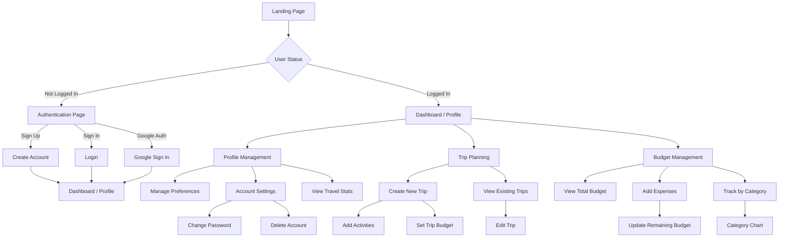

# TravelGenie: Travel Itinerary Planner

## Introduction
TravelGenie is a full-featured travel itinerary planning app designed to help users organize their trips, manage daily activities, and track travel budgets. The application allows users to create and customize itineraries, add and arrange activities using drag-and-drop, and monitor expenses with a built-in budget tracker. User authentication is handled securely via Firebase, ensuring user data privacy and personalized experiences.

## Project Type
Frontend

## Deployed App
Frontend: https://masai-travel-genie.vercel.app

Backend: (Firebase Realtime Database)

Database: (Firebase Realtime Database)

## Directory Structure

```bash
Travel_Genie/
├─ css/
│  ├─ auth.css
│  ├─ budget.css
│  ├─ itinerary.css
│  ├─ profile.css
│  └─ style.css
├─ docs/
│  ├─ project_description.md
│  └─ user_flow.md
├─ images/
│  └─ Logo.jpg
├─ index.html
├─ js/
│  ├─ auth.js
│  ├─ budget.js
│  ├─ config.js
│  ├─ itinerary.js
│  └─ profile.js
├─ pages/
│  ├─ auth.html
│  ├─ budget.html
│  ├─ itinerary.html
│  └─ profile.html
```


## User Flow Diagram




## Video Walkthrough of the project
_Video walkthrough of all of the features:  [Link](https://drive.google.com/file/d/1xkrUET3NtOfypLvbVC76NPor1C0XbtUG/view?usp=sharing)_

## Features
- User authentication (sign up, login, logout) with Firebase
- Create, edit, and delete travel itineraries
- Drag-and-drop to organize activities by day
- Add, edit, and remove activities for each day
- Budget tracking and expense management
- Visual budget progress bar
- Share and save itineraries
- Responsive and modern UI

## Design decisions or assumptions
- Used Firebase for secure and scalable authentication and data storage
- All itinerary and budget data is scoped to the authenticated user
- UI/UX is optimized for clarity and ease of use, including modals and dynamic feedback
- Shopify Draggable library is used for intuitive drag-and-drop
- No backend server; all data is handled via Firebase

## Installation & Getting started
1. Clone the repository or copy the project folder:
```bash
cd "Travel_Genie"
```
2. Add your Firebase configuration to `js/config.js`:
```js
// js/config.js
const firebaseConfig = {
  apiKey: "YOUR_API_KEY",
  authDomain: "YOUR_AUTH_DOMAIN",
  databaseURL: "YOUR_DATABASE_URL",
  projectId: "YOUR_PROJECT_ID",
  storageBucket: "YOUR_STORAGE_BUCKET",
  messagingSenderId: "YOUR_MESSAGING_SENDER_ID",
  appId: "YOUR_APP_ID"
};
```
3. Open `index.html` (or any page in `pages/`) in your browser to run the app locally.

## Usage
- Sign up or log in with your email and password
- Create a new itinerary and add days/activities
- Drag and drop activities to rearrange them
- Set a travel budget and add expenses to track spending
- Save or share your itinerary with others

## Credentials
Demo User (if available):
- Email: demo@travelgenie.com
- Password: Demo1234

## APIs Used
- [Firebase Authentication](https://firebase.google.com/docs/auth)
- [Firebase Realtime Database](https://firebase.google.com/docs/database)
- [Shopify Draggable](https://shopify.github.io/draggable/)

## API Endpoints
_All data operations are handled via Firebase Realtime Database. Example structure:_
- `users/{uid}/itineraries` - User itineraries
- `users/{uid}/budget` - User budgets and expenses

## Technology Stack
- HTML, CSS, JavaScript (Vanilla)
- Firebase (Authentication, Realtime Database)
- Shopify Draggable (for drag-and-drop)
- Modern responsive design